# Practica de Busqueda Local: distribucion de energia electrica

Informe de la primera practica de Inteligencia Artificial (FIB-UPC).

**Grupo:** Denys, Albert, Bernat

---

## 0. Como leer este informe y como reproducirlo

Todos los numeros salen de una unica ejecucion de la bateria completa, recogida en
[resultados/salida_completa.txt](resultados/salida_completa.txt). El detalle replica a replica
esta en `resultados/exp1.csv` .. `resultados/exp8.csv`, las figuras en `resultados/fig*.png` y
los contrastes estadisticos en [resultados/comparaciones.txt](resultados/comparaciones.txt).
Las instrucciones para regenerarlo todo estan en el [README](README.md).

Salvo que se diga lo contrario, el escenario es el del apartado 4.6.1 del enunciado: 5
centrales de tipo A, 10 de tipo B y 25 de tipo C; 1.000 clientes con proporciones 25 % XG,
30 % MG y 45 % G, y un 75 % con contrato garantizado.

**Diseno experimental.** Cada configuracion se ejecuta con 10 replicas, y las 10 semillas
(1000, 1077, ..., 1693) son **las mismas para todas las configuraciones que se comparan**. Eso
hace que las observaciones esten emparejadas: la replica 3 de la configuracion A y la replica 3
de la configuracion B son el mismo escenario. Las tablas dan media y (desviacion tipica).

Esta eleccion es importante porque la variabilidad entre escenarios es grande (la desviacion
tipica del beneficio ronda los 45.000 eur, un 3,3 %) y enmascara diferencias sistematicas
mucho menores. Por eso, ademas de comparar medias, se usa el contraste que propone el apartado
7.5 del enunciado: bajo la hipotesis nula de que dos configuraciones son igual de buenas, el
numero de replicas en las que gana una de ellas sigue una binomial B(10, 0,5), y ganar las 10
tiene probabilidad 0,001 (valor p bilateral 0,002). Ese calculo lo hace
[Comparaciones.java](src/IA/PracticaEnergia/Comparaciones.java).

### Software utilizado

- **AIMA**: `AIMA.jar` del material de la asignatura, con sus dependencias en `lib/lib/`. Se ha
  usado tambien el codigo fuente (`AIMA.src.zip`, copiado en `docs/aima-src/`) para entender
  con exactitud como se comportan `HillClimbingSearch` y `SimulatedAnnealingSearch`; varias
  conclusiones de este informe dependen de detalles de esa implementacion y se senalan al
  llegar a ellos.
- **CentralEnergia.jar**: generador de escenarios facilitado con el enunciado.
- **JFreeChart 1.0.13**, que viene entre las dependencias de AIMA, para generar las figuras
  desde [Graficas.java](src/IA/PracticaEnergia/Graficas.java). No se ha usado ninguna
  herramienta externa.

---

## 1. Analisis del problema

### 1.1. Elementos y por que es un problema de busqueda local

Una solucion asigna a cada cliente **como mucho una** central, o ninguna si es un cliente no
garantizado al que se decide no servir. El criterio a maximizar es

```
beneficio = ingresos por clientes servidos
          - coste de las centrales (marcha si tienen algun cliente, parada si no)
          - indemnizaciones a los no garantizados sin servir
```

Hay dos propiedades del enunciado que condicionan todo el diseno y que conviene tener presentes
porque explican casi todos los resultados experimentales:

1. **Una central en marcha cuesta toda su produccion, se use o no.** El coste no depende de
   cuanta energia se sirve desde ella, solo de si esta encendida. Es decir, **el coste marginal
   de anadir un cliente a una central ya encendida es exactamente cero**.
2. **Las perdidas de transporte no son un coste en euros, son un consumo de capacidad.** Al
   cliente se le factura su consumo contratado; lo que cambia con la distancia es cuantos Mw
   hay que producir: `mw = consumo / (1 - perdida(distancia))`, hasta 2,5 veces el consumo si la
   central esta a mas de 75 km.

De la primera propiedad se deduce algo que resulta ser decisivo: **el beneficio no depende de
como se repartan los clientes, sino solo de que centrales estan encendidas y de que clientes
quedan sin servir.** El reparto concreto solo importa de forma indirecta, porque determina si el
reparto cabe. Volveremos a esto en el apartado 4.

Es un problema de busqueda local, y no de busqueda en espacio de estados clasica, por tres
razones. No existe un estado objetivo reconocible: cualquier asignacion valida es una solucion
y lo que se busca es la mejor, no una concreta. El espacio es inabarcable (ver 1.2), asi que no
se puede explorar sistematicamente ni acotar con una heuristica admisible. Y el camino hasta la
solucion no tiene ningun valor: solo interesa el estado final, no la secuencia de operadores que
lleva a el.

### 1.2. Tamano del espacio de busqueda

Cada cliente puede estar en cualquiera de las `nCentrales` centrales o sin servir, luego hay del
orden de `(nCentrales + 1)^nClientes` combinaciones, que en el escenario base son `41^1000`, un
numero de unas 1.600 cifras. Solo una fraccion cumple las restricciones de capacidad y de
servicio garantizado, pero sigue siendo una fraccion inmensa.

Conviene contrastarlo con la dimension que de verdad determina el beneficio. Por lo dicho en
1.1, el beneficio solo depende de **que centrales estan encendidas** (40 variables binarias,
`2^40` combinaciones) y de **que no garantizados se sirven**. El espacio de asignaciones es
enormemente mas grande que el espacio de decisiones que afectan al objetivo, y esa desproporcion
es exactamente la que produce las mesetas que se describen en el apartado 4.

### 1.3. Holgura del problema

Un dato clave para interpretar casi todos los experimentos: en el escenario base la produccion
instalada son unos 5.900 Mw y la demanda contratada por los clientes garantizados unos 3.940 Mw.
El margen parece comodo, pero hay que servir esa demanda **con perdidas**, y la perdida media
entre dos puntos cualesquiera de un cuadrado de 100x100 km ronda el 50 %. Si los clientes se
asignasen al azar harian falta unos 5.900 Mw, justo toda la capacidad instalada.

Es decir: **el problema solo tiene solucion si los clientes se sirven desde centrales cercanas.**
El cociente entre la cota minima de Mw necesarios (sirviendo a cada garantizado desde su central
mas cercana) y la produccion instalada es 0,67 en el escenario base. El experimento 4 muestra
que cuando ese cociente llega a 0,93 el problema ya es infactible.

---

## 2. Representacion del estado

Implementada en [EstadoEnergia.java](src/IA/PracticaEnergia/EstadoEnergia.java).

El criterio de diseno viene impuesto por como funciona AIMA: `NodeExpander.expandNode()`
construye un `ArrayList` con **todos** los sucesores del nodo actual antes de que Hill Climbing
elija uno. Con miles de sucesores por paso, el tamano de una instancia multiplica la memoria de
pico y el coste de copiarla multiplica el tiempo de cada paso. De ahi dos reglas.

### 2.1. Todo lo que no cambia es estatico

Se comparte entre todos los nodos, de modo que generar un sucesor no duplica ni un byte de esta
informacion:

| Estructura | Contenido |
|---|---|
| `centrales`, `clientes` | las listas que genera la libreria del enunciado |
| `mwNecesarios[cli*nCen+cen]` | Mw a producir para servir al cliente desde la central, con la perdida ya aplicada |
| `consumo[]`, `ingresoServir[]`, `penalNoServir[]` | consumo, tarifa e indemnizacion ya multiplicadas |
| `produccion[]`, `costeEnMarcha[]`, `costeEnParada[]`, `sobrecosteEncender[]` | costes por central |
| `centralesCercanas[]`, `clientesCercanos[]` | las k centrales / clientes mas cercanos a cada cliente |

`mwNecesarios` se calcula una sola vez: son 1.000 x 40 doubles, 320 KB compartidos, y evita una
raiz cuadrada y una consulta de perdidas en el bucle mas caliente del programa. Se guarda
**aplanada** en un unico array en vez de `double[][]` para tener un solo objeto y mejor localidad
de cache.

### 2.2. La parte dinamica son arrays primitivos

Es lo unico que se copia al generar un sucesor:

| Campo | Tipo | Tamano con 1000 clientes y 40 centrales |
|---|---|---|
| `asignacion` | `int[nClientes]`, indice = cliente, valor = central o -1 | 4.016 B |
| `ocupacion` | `double[nCentrales]`, Mw comprometidos | 336 B |
| `clientesPorCentral` | `int[nCentrales]`, >0 significa encendida | 176 B |
| `beneficio`, `centralesEncendidas`, `garantizadosSinServir` | escalares | 24 B |
| `mwProducidos`, `mwContratados`, `produccionEncendida` | escalares (apartado 5) | 24 B |

En total unos **4,6 KB por nodo**, y copiar uno son tres `clone()` de array mas seis escalares:
**792 ns medidos** sobre 200.000 copias. La alternativa "natural" de guardar una lista de
clientes por central, o un `HashMap<Cliente,Central>`, costaria entre 50 y 100 KB por nodo y
obligaria a recorrer objetos para clonar, un orden de magnitud peor en las dos cosas.

### 2.3. Todas las magnitudes se mantienen de forma incremental

El beneficio no se recalcula recorriendo los 1.000 clientes en cada sucesor: cada operador ajusta
el campo con las diferencias que provoca, en O(1). Lo mismo con las tres magnitudes energeticas
que necesitan las heuristicas del apartado 5. Solo hay dos puntos del codigo que las tocan
(`asigna` y `desasigna`), lo que hace facil comprobar que son correctas;
[PruebaEstado](src/IA/PracticaEnergia/PruebaEstado.java) aplica miles de operaciones aleatorias y
verifica que ningun valor incremental se separa del recalculado desde cero.

### 2.4. Validez por construccion

Las restricciones 1 a 5 del apartado 4.3 del enunciado no hace falta comprobarlas en la
heuristica, porque la representacion y los operadores las hacen imposibles de violar:

- *Un cliente en una sola central*: es la propia definicion de `asignacion`.
- *No superar la produccion*: `cabe()` se comprueba antes de cada asignacion.
- *Servir la demanda completa*: no existe la asignacion parcial.
- *Garantizados servidos*: la solucion inicial los sirve todos y `puedeDesasignar()` se niega a
  quitarlos.

La unica excepcion es el experimento 5, que traslada deliberadamente la ultima restriccion a la
funcion heuristica para comparar los dos enfoques.

---

## 3. Estrategias de solucion inicial

Se han implementado dos estrategias validas, mas una vacia que solo se usa en el experimento 5.

**ALEATORIA.** Recorre los clientes garantizados en orden aleatorio y asigna cada uno a una
central elegida al azar entre sus 8 mas cercanas que aun tengan hueco. Los no garantizados quedan
sin servir. Coste `O(nClientes * k)`, practicamente instantanea.

**VORAZ.** Ordena los garantizados por consumo descendente y coloca cada uno prefiriendo una
central **ya encendida** con hueco (coste marginal cero) y, de esas, la que menos capacidad
consuma. Solo enciende una central nueva cuando ninguna encendida cabe, y entonces elige la de
menor coste por Mw de capacidad instalada, que es siempre una de tipo A (unos 60 eur/Mw frente a
109 de una B y 214 de una C). Despues anade los no garantizados que quepan en lo ya encendido,
que son beneficio puro. Coste `O(nClientes * k)` mas la ordenacion.

Resultado en el escenario base (semilla 1234):

| Estrategia | Beneficio inicial | Centrales encendidas | Clientes servidos |
|---|---|---|---|
| ALEATORIA | 902.385 | 40 de 40 | 731 de 1.000 |
| VORAZ | 1.187.340 | 29 de 40 | 792 de 1.000 |

La diferencia principal no es el beneficio sino **cuantas centrales quedan encendidas**: la
aleatoria enciende las 40 porque reparte los clientes por todas partes, mientras que la voraz
concentra en 29. Como el coste de las centrales es el termino dominante, eso explica casi toda la
diferencia.

### Por que las dos miran solo las 8 centrales mas cercanas

Las dos estrategias usan un radio fijo de 8 candidatas, con independencia del vecindario `k` que
usen despues los operadores. Es deliberado, por dos motivos.

El metodologico: al comparar valores de `k` en el experimento 1 interesa que todas las
ejecuciones partan exactamente de la misma solucion inicial, para que la diferencia medida sea la
del operador y no la del punto de partida.

El de correccion: con el vecindario sin restringir, las estrategias colocan clientes en centrales
lejanas, cada una consume hasta 2,5 veces su consumo en capacidad y, como se vio en 1.3, el parque
se agota antes de colocarlos a todos. De hecho la primera version del voraz, que preferia
cualquier central encendida sin mirar la distancia, fallaba al no poder colocar a los ultimos
garantizados. Cuando el escenario es genuinamente infactible el programa lo detecta y lo informa
con [EscenarioInfactibleException](src/IA/PracticaEnergia/EscenarioInfactibleException.java) en
vez de fallar.

---

## 4. Operadores

| Operador | Condicion de aplicabilidad | Efecto | Ramificacion (k=8) |
|---|---|---|---|
| `MOVER(cli, cen)` | el cliente esta servido, `cen` es una de sus k mas cercanas y tiene hueco | cambia el cliente de central | servidos x k, ~6.000 |
| `ASIGNAR(cli, cen)` | el cliente no esta servido y `cen` tiene hueco | da de alta a un no garantizado | ~2.000 |
| `DESASIGNAR(cli)` | el cliente esta servido y no es garantizado | da de baja a un no garantizado | ~800 |
| `INTERCAMBIAR(a, b)` | ambos servidos, cercanos, y las dos capacidades permiten el cruce | intercambia sus centrales | servidos x k / 2, ~3.000 |
| `CERRAR(cen)` | la central esta encendida y sus clientes caben en otras | apaga la central reubicando a todos sus clientes | una por central, 40 |
| `ABRIR(cen)` | la central esta parada | la enciende y la llena con clientes sin servir | una por central, 40 |

### 4.1. Por que hacen falta operadores compuestos

`ABRIR` y `CERRAR` son operadores **compuestos** (una sola aplicacion mueve muchos clientes) y
son la parte menos obvia del diseno. La razon de anadirlos se ve en cuanto se ejecuta Hill
Climbing con los operadores simples: **se para en el primer paso** (experimento 1).

El motivo es la propiedad del apartado 1.1: el beneficio solo depende de que centrales estan
encendidas. Mover un cliente de una central encendida a otra encendida deja el beneficio
exactamente igual. Como Hill Climbing exige **mejora estricta** (en el codigo de AIMA, para
cuando `getValue(vecino) <= getValue(actual)`), el espacio de busqueda es una meseta para `MOVER`
y para `INTERCAMBIAR`, y el algoritmo no avanza ni un paso.

Y por el otro lado, encender una central para un solo cliente nunca mejora: el arranque mas
barato son unos 11.000 eur y el cliente mas rentable aporta unos 8.000. Asi que un `ASIGNAR` que
tuviera que encender una central tampoco es nunca una mejora, y Hill Climbing no da nunca ese
primer paso aunque encender esa central y llenarla fuese muy rentable.

`CERRAR` y `ABRIR` resuelven las dos cosas mostrando la mejora entera de golpe: vacian o llenan
una central completa en un solo movimiento. Ademas son baratisimos, una sola alternativa por
central frente a los miles de los operadores simples. `ABRIR` llena la central como una mochila,
por beneficio aportado dividido entre capacidad consumida, criterio que prioriza a los clientes
cercanos y rentables y que ademas se adapta solo al modo del experimento 5.

Los conjuntos que se comparan estan en
[ConjuntoOperadores.java](src/IA/PracticaEnergia/ConjuntoOperadores.java).

### 4.2. Acotacion del vecindario

Los operadores solo consideran las `k` centrales (o clientes) mas cercanos. Con `k = 40`, mover
cualquier cliente a cualquier central da 40.000 sucesores por paso, que a 4,6 KB por estado son
mas de 180 MB de pico. Las centrales lejanas pierden hasta el 60 % de la energia y casi nunca
forman parte de una buena solucion, asi que restringir el vecindario apenas deberia costar
calidad; el experimento 1 lo mide.

### 4.3. Generacion de sucesores, distinta para cada algoritmo

- **Hill Climbing** ([GeneradorSucesoresHC](src/IA/PracticaEnergia/GeneradorSucesoresHC.java)):
  devuelve todas las aplicaciones legales de los operadores, porque el algoritmo necesita elegir
  la mejor.
- **Simulated Annealing** ([GeneradorSucesoresSA](src/IA/PracticaEnergia/GeneradorSucesoresSA.java)):
  elige un operador al azar y unos parametros al azar y devuelve **un solo** sucesor. Esto no es
  una simplificacion, es lo correcto y ademas lo eficiente: mirando el codigo de
  `SimulatedAnnealingSearch` se ve que llama a `expandNode` en cada iteracion y despues se queda
  con **un elemento al azar** de la lista (`aima.basic.Util.selectRandomlyFromList`). Generar la
  lista completa significaria construir miles de estados para tirar todos menos uno, cien mil
  veces.

Las cadenas de accion son constantes compartidas y no se formatean por sucesor: con miles de
sucesores por paso, construir un `String` descriptivo para cada uno costaria mas que generar el
propio estado.

---

## 5. Funciones heuristicas

Implementadas en [FuncionHeuristica.java](src/IA/PracticaEnergia/FuncionHeuristica.java). Los
algoritmos de AIMA **minimizan** la heuristica (internamente usan `valor = -heuristica` y suben
por ese valor), y el enunciado pide maximizar la ganancia: la diferencia es un cambio de signo.

### 5.1. Los factores que intervienen

El objetivo real tiene tres terminos, y conviene ver la escala de cada uno en el escenario base
para entender que pondera que:

| Termino | Orden de magnitud | Cambia con... |
|---|---|---|
| Ingresos por cliente servido | 1.000 a 8.000 eur por cliente | que clientes se sirven |
| Coste de una central | 11.000 a 90.000 eur de sobrecoste al encenderla | que centrales estan encendidas |
| Indemnizacion a un no garantizado | ~30 % de su tarifa | que no garantizados se dejan sin servir |

El termino dominante es con diferencia el de las centrales, y es el unico que no cambia de forma
continua: enciende o apaga. Por eso el objetivo puro produce mesetas.

### 5.2. Las tres variantes

**H1, beneficio puro.** `h = -beneficio`. Es el objetivo del enunciado, sin mas. Es la heuristica
"correcta" en el sentido de que optimiza exactamente lo que se pide.

Su defecto como funcion **guia** es el que ya se ha explicado: es ciega a todos los operadores que
no encienden ni apagan una central. Las variantes siguientes anaden un criterio secundario,
ponderado, que si distingue esos estados y convierte parte de la meseta en pendiente. Son
criterios de **desempate**, no objetivos: el beneficio que se reporta en todos los experimentos es
siempre el beneficio real, nunca el valor de la heuristica, de modo que las tres son comparables
entre si.

**H2, penalizar las perdidas de transporte.** `h = -(beneficio - w * mwPerdidos)`, donde
`mwPerdidos` son los Mw que se producen y se pierden por el camino. Es la unica magnitud que
cambia al mover un cliente entre dos centrales ya encendidas, asi que es la candidata natural para
dar gradiente a `MOVER`. La justificacion economica es que las perdidas consumen capacidad, y la
capacidad libre es lo que permite encender menos centrales.

**H3, penalizar la capacidad ociosa.** `h = -(beneficio - w * capacidadOciosa)`, donde
`capacidadOciosa` es la produccion de las centrales en marcha que no se esta usando para nada.
Empuja a concentrar los clientes en pocas centrales bien llenas, que es precisamente la situacion
desde la que se puede apagar una central.

### 5.3. Justificacion de la ponderacion

El peso `w` esta en eur/Mw, las mismas unidades que las tarifas (que van de 400 a 600 eur/Mw para
los garantizados), de forma que es interpretable: `w = 10` significa "un Mw perdido vale lo mismo
que 10 eur de beneficio", un 2 % de la tarifa.

La ponderacion tiene que cumplir dos condiciones opuestas. Ha de ser **lo bastante grande** para
romper los empates, es decir, para que dos estados con el mismo beneficio se ordenen. Y ha de ser
**lo bastante pequena** para no invertir nunca el orden entre dos estados cuyo beneficio real si
difiere, porque en ese caso la busqueda dejaria de optimizar el objetivo. Como los saltos de
beneficio relevantes son de miles de euros y las magnitudes secundarias son de cientos de Mw, el
rango util previsto va de 1 a unas pocas decenas de eur/Mw. El experimento 7 lo comprueba
barriendo `w` entre 1 y 200.

Las restricciones no se penalizan en ninguna de las tres, porque los operadores no pueden
violarlas (apartado 2.4). La unica excepcion es el experimento 5, que traslada a la heuristica la
restriccion de los garantizados mediante `activaModoPenalizacion`.

---

## 6. Como funcionan realmente los algoritmos de AIMA

Tres detalles de la implementacion de la asignatura que no son los del libro y sin los cuales
varios resultados de los experimentos parecerian inexplicables. Estan comprobados sobre el codigo
fuente de `AIMA.src.zip`, en `docs/aima-src/aima/search/informed/`.

**1. La probabilidad de aceptacion del recocido es logistica, no exponencial.** El codigo calcula
`prob = 1/(1 + e^(deltaE/T))` y acepta el sucesor si `deltaE > 0` o si un uniforme supera `prob`.
La probabilidad de aceptar un empeoramiento queda entonces en `1/(1 + e^(-deltaE/T))`, que para
empeoramientos grandes coincide con el `e^(deltaE/T)` del libro, pero que **para `deltaE = 0` vale
exactamente 1/2**. Es decir, el recocido acepta los movimientos laterales la mitad de las veces,
y lo hace con independencia de la temperatura. Esto resultara ser la clave del experimento 8.

**2. La temperatura es una escalera y se anula por desbordamiento.** `Scheduler.getTemp(t)`
calcula `k * e^(-lambda * ((t/limite)*limite))` con division entera, asi que la temperatura se
mantiene constante en bloques de `limite` iteraciones. Y el bucle principal **se corta en cuanto
la temperatura llega a 0**. Como un `double` se desborda a cero cuando el exponente baja de unos
-745, el recocido se detiene en `t ≈ 745/lambda` **aunque se le hayan pedido mas iteraciones**:

| lambda | Iteracion en la que la temperatura se anula | Consecuencia con 100.000 pasos pedidos |
|---|---|---|
| 1 | ~800 | ejecuta 800 pasos, ~2 ms |
| 0,01 | ~74.600 | ejecuta 74.600 pasos, ~300 ms |
| 0,0001 | ~7.450.000 | ejecuta los 100.000, ~420 ms |

Los tiempos medidos en el experimento 3 (2,4 / 322 / 431 ms) encajan con esta prediccion a un
coste constante de unos 4,2 microsegundos por iteracion, lo que confirma la lectura del codigo.

**3. El recocido devuelve el mejor estado visitado, no el ultimo.** El codigo mantiene una
variable `best` y es la que expone en `getGoalState()`. Por tanto el recocido nunca puede
terminar peor que su punto de partida, y no hace falta anadir nada para conservar el mejor.

Una limitacion que se deriva de leer el codigo: `SimulatedAnnealingSearch` crea internamente un
`java.util.Random` **sin semilla**, asi que sus ejecuciones **no son exactamente reproducibles**.
Se pueden fijar las semillas de la generacion del escenario y del generador de sucesores, pero no
la de la aceptacion. Por eso todas las conclusiones sobre el recocido se apoyan en medias sobre 10
replicas y no en valores individuales. Las cifras de Hill Climbing si son deterministas y se
repiten exactamente entre ejecuciones.

---

## 7. Experimentos

### 7.1. Experimento 1: conjunto de operadores

**Condiciones.** Escenario base, Hill Climbing, solucion inicial VORAZ, k = 8, 10 replicas.

**Hipotesis.** Que mas operadores den mejor solucion a cambio de mas tiempo, con una mejora
progresiva entre conjuntos.

| Operadores | Beneficio | Tiempo (ms) | Pasos | Centrales |
|---|---|---|---|---|
| MOVER | 1.207.656 (46.790) | 2,3 | 1,0 | 31,7 |
| MOVER_ASIGNAR | 1.207.656 (46.790) | 1,5 | 1,0 | 31,7 |
| MOVER_INTERCAMBIAR | 1.207.656 (46.790) | 1,2 | 1,0 | 31,7 |
| **MOVER_ASIGNAR_CENTRALES** | **1.358.883 (44.334)** | 14,5 | 10,8 | 36,3 |
| COMPLETO | 1.358.883 (44.334) | 20,9 | 10,8 | 36,3 |

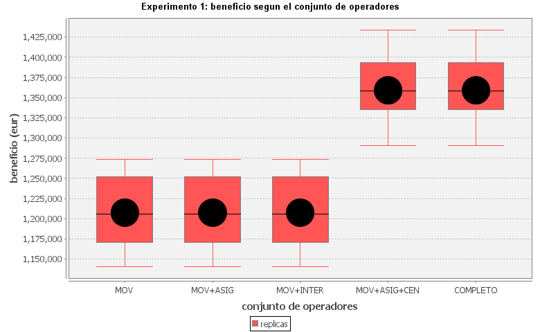

**Resultado.** Mucho mas tajante que la hipotesis. Los tres primeros conjuntos dan **exactamente**
el mismo valor, replica a replica, y se paran en **un solo paso**: son incapaces de mejorar la
solucion voraz. Es la meseta que se anticipo en el apartado 4.1, y confirma que en este problema
los operadores que mueven clientes uno a uno son inutiles por si solos. En cuanto se anaden
`ABRIR` y `CERRAR` el beneficio sube un 12,5 % y la busqueda da 10,8 pasos de media; la mejora se
da en las 10 replicas (p = 0,002).

`COMPLETO` da exactamente lo mismo que `MOVER_ASIGNAR_CENTRALES` pero tarda un 44 % mas: el
intercambio anade unos 3.000 sucesores por paso y **nunca** es el mejor de ellos, porque no cambia
que centrales estan encendidas. Se elige por tanto **MOVER_ASIGNAR_CENTRALES**.

**Influencia del vecindario k:**

| k | Beneficio | Tiempo (ms) | Pasos |
|---|---|---|---|
| 2 | 1.353.253 (48.854) | 2,5 | 7,1 |
| 4 | 1.361.616 (46.624) | 2,4 | 8,5 |
| 8 | 1.358.883 (44.334) | 8,5 | 10,8 |
| 16 | 1.356.213 (45.801) | 15,2 | 10,6 |
| 40 | 1.358.171 (46.144) | 43,7 | 11,5 |

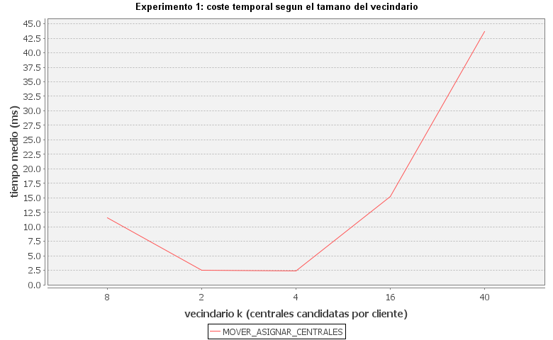

El tiempo crece de forma practicamente lineal con `k` (de 2,5 a 44 ms, 17 veces) mientras que el
beneficio se mueve dentro de un margen del 0,6 %, muy por debajo de la desviacion tipica entre
replicas (46.000, un 3,4 %). Restringir el vecindario **no cuesta calidad y ahorra un orden de
magnitud de tiempo y de memoria**, lo que confirma la intuicion de que las centrales lejanas no
entran en las buenas soluciones. Se fija **k = 8**.

### 7.2. Experimento 2: estrategia de solucion inicial

**Condiciones.** Escenario base, Hill Climbing, operadores MOVER_ASIGNAR_CENTRALES, 10 replicas.

**Hipotesis.** Que la voraz llegue antes (menos pasos) pero que las dos acaben en soluciones de
calidad parecida, que es lo que suele pasar en estos problemas y lo que muestra el ejemplo del
TSP del enunciado.

| Estrategia | Beneficio inicial | Beneficio final | Tiempo (ms) | Pasos |
|---|---|---|---|---|
| ALEATORIA | 880.067 (66.066) | 1.282.558 (57.065) | 3,5 | 7,7 |
| **VORAZ** | 1.207.656 (46.790) | **1.358.883 (44.334)** | 7,7 | 10,8 |

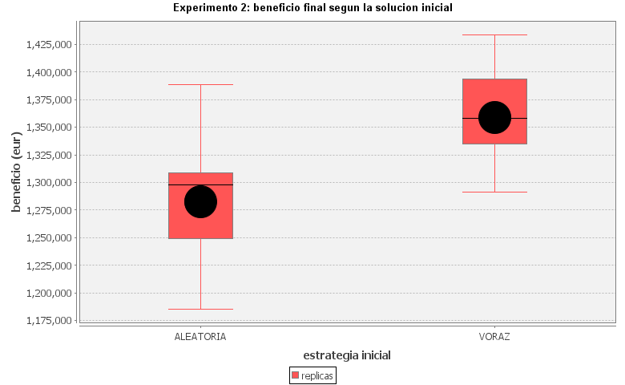

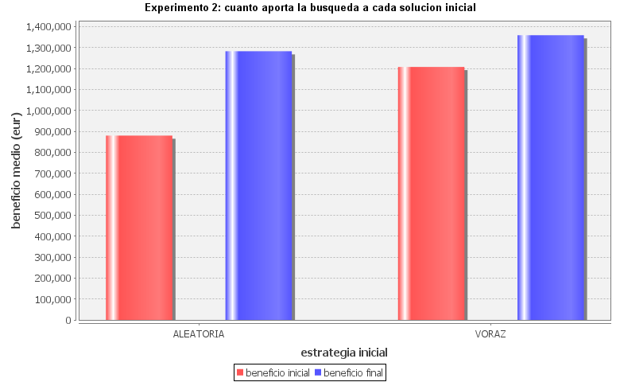

**Resultado.** Lo contrario en las dos cosas. La voraz gana en calidad de forma clara (un 6,0 %
mas de beneficio) y **gana en las 10 replicas** (p = 0,002). Y ademas necesita **mas** pasos, no
menos (10,8 frente a 7,7).

La explicacion es la misma meseta de antes: Hill Climbing no puede reparar una mala distribucion
de clientes, solo puede abrir y cerrar centrales. La solucion aleatoria enciende las 40 centrales
y reparte a los clientes de cualquier manera, y desde ahi la busqueda cierra unas cuantas pero se
queda en un optimo local peor. Curiosamente eso hace que termine *antes*: se queda sin mejoras
disponibles antes.

**Conclusion.** En este problema la calidad del punto de partida no es solo cuestion de
velocidad, **determina el optimo local al que se llega**. Se fija VORAZ.

### 7.3. Experimento 3: parametros del Simulated Annealing

**Condiciones.** Escenario base, inicial VORAZ, operadores MOVER_ASIGNAR_CENTRALES, 100.000
iteraciones con 100 por temperatura, 10 replicas. Siguiendo la recomendacion del enunciado se
parte de valores extremos y se refina despues.

**Hipotesis.** Un efecto claro de los dos parametros, con temperaturas altas explorando mas y
encontrando mejores soluciones a cambio de tiempo.

| k \ lambda | 1,0 | 0,01 | 0,0001 |
|---|---|---|---|
| 1 | 1.352.614 | 1.356.557 | 1.356.779 |
| 5 | 1.353.763 | 1.355.647 | **1.357.379** |
| 25 | 1.353.170 | 1.356.149 | 1.356.613 |
| 125 | 1.355.010 | 1.356.870 | 1.356.558 |

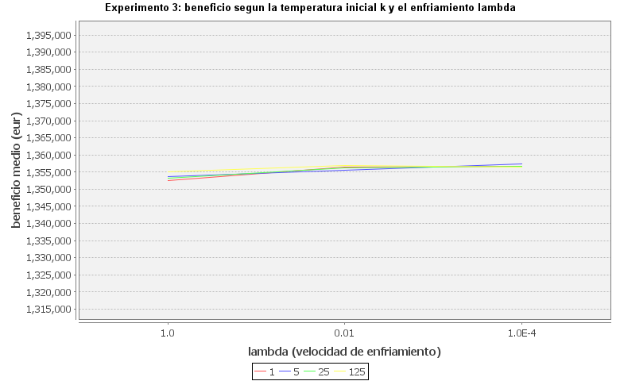

**Resultado.** El beneficio es **practicamente insensible a los dos parametros**: las doce medias
caben en un 0,35 %, frente a una desviacion entre replicas del 3,3 %. La figura esta dibujada con
el eje abierto a una desviacion tipica a cada lado de la media precisamente para que eso se vea;
con el eje autoajustado, las mismas doce medias parecerian muy separadas, que es justo el error
que advierte el apartado 7.4 del enunciado.

Que `k` no influya tiene una explicacion cuantitativa. Los saltos de energia entre estados vecinos
son de miles o decenas de miles de euros, mientras que `k` se mueve entre 1 y 125. Con
`deltaE = -1.000` y `T = 125`, la probabilidad de aceptar el empeoramiento es `1/(1+e^8)`, un
0,03 %. Para que `k` tuviese un efecto real habria que llevarlo al orden de magnitud de los saltos
de energia, es decir, a varios miles.

Donde si hay un efecto enorme es en el **tiempo**, y por la razon descrita en el apartado 6:

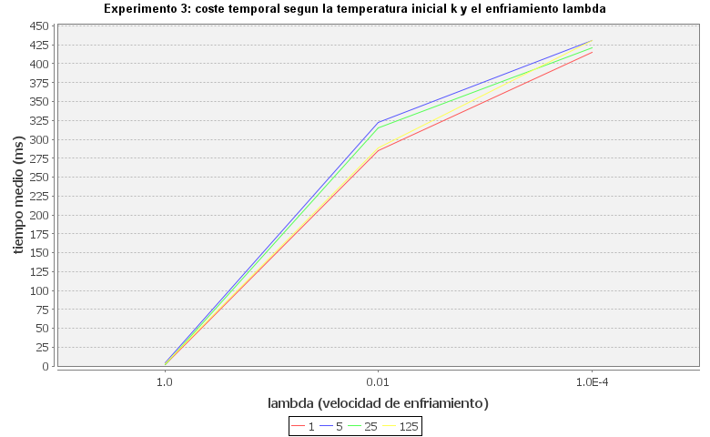

| lambda | Tiempo medio (ms) | Iteraciones realmente ejecutadas |
|---|---|---|
| 1 | 2,4 a 3,9 | ~800, la temperatura se desborda a cero |
| 0,01 | 285 a 322 | ~74.600, idem |
| 0,0001 | 415 a 431 | las 100.000 pedidas |

**Numero de iteraciones** (k=5, lambda=0,01):

| Iteraciones | Por temperatura | Beneficio | Tiempo (ms) |
|---|---|---|---|
| 10.000 | 100 | 1.354.651 | 38,9 |
| 50.000 | 100 | 1.355.495 | 199,3 |
| 100.000 | 100 | **1.358.089** | 295,2 |
| 250.000 | 100 | 1.355.603 | 317,0 |
| 100.000 | 10 | 1.356.702 | 318,8 |
| 100.000 | 1.000 | 1.355.257 | 307,2 |

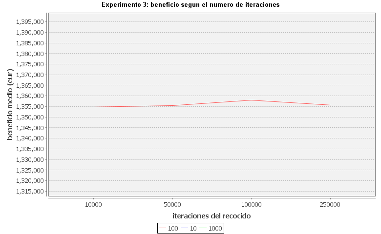

Pedir 250.000 iteraciones en vez de 100.000 no cambia ni el beneficio ni apenas el tiempo, y
ahora sabemos exactamente por que: con `lambda = 0,01` la temperatura se anula en la iteracion
74.600 y el bucle se corta ahi en los dos casos. **El parametro `pasos` solo tiene efecto mientras
sea menor que `745/lambda`.** Es un ejemplo de conclusion que seria imposible de explicar sin
haber leido el codigo, y que de otro modo se habria atribuido a que el algoritmo "converge".

**Parametros elegidos: 100.000 iteraciones, 1.000 por temperatura, k = 5, lambda = 0,01.** El
criterio no es el argmax de la tabla (que cambia de una ejecucion a otra, porque las diferencias
son ruido), sino que `lambda = 0,01` da la misma calidad que `lambda = 0,0001` empleando un 30 %
menos de tiempo, y que `k` es indiferente.

### 7.4. Experimento 4: escalado del tiempo

**Condiciones.** Hill Climbing, inicial VORAZ, operadores y k ya fijados, 10 replicas.

**Hipotesis.** Crecimiento aproximadamente lineal con el numero de clientes, ya que el factor de
ramificacion es `clientes x k` con `k` fijo.

**Variando el numero de clientes (40 centrales):**

| Clientes | Beneficio | Tiempo (ms) | Pasos | Demanda min / capacidad |
|---|---|---|---|---|
| 250 | 174.790 | 1,4 | 5,3 | 0,16 |
| 500 | 608.511 | 4,9 | 4,7 | 0,34 |
| 750 | 1.012.513 | 9,2 | 6,1 | 0,53 |
| 1.000 | 1.358.883 | 10,1 | 10,8 | 0,67 |
| 1.250 | INFACTIBLE | - | - | 0,93 |

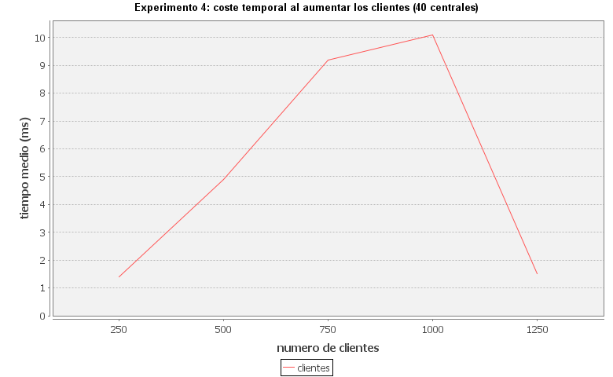

El tiempo crece de forma aproximadamente lineal, como se esperaba: la ramificacion y el coste de
copiar un estado son lineales en el numero de clientes, y el numero de pasos hasta el optimo local
depende sobre todo del numero de centrales, que aqui no cambia.

El resultado no previsto es que **a partir de 1.250 clientes el problema deja de tener solucion**.
La ultima columna es el cociente entre la cota minima de Mw necesarios y la capacidad instalada;
al llegar a 0,93 ya no hay reparto posible que respete a la vez los limites por central. No es un
fallo del algoritmo sino una propiedad de los datos, y el programa lo detecta y lo informa.

**Variando el numero de centrales (1.000 clientes, proporciones 1:2:5):**

| Centrales | Beneficio | Tiempo (ms) | Pasos |
|---|---|---|---|
| 40 | 1.358.883 | 11,0 | 10,8 |
| 80 | 1.241.095 | 33,2 | 7,4 |
| 120 | 982.728 | 87,1 | 14,2 |
| 160 | 714.225 | 122,9 | 18,2 |

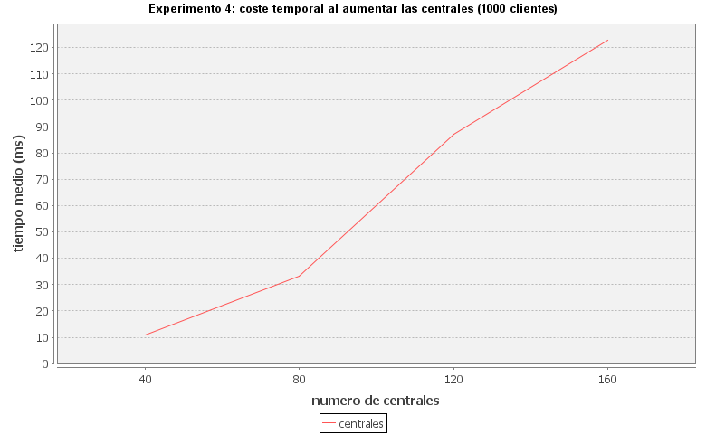

Aqui el tiempo crece **mas rapido que lineal** (x4 centrales, x11 tiempo), porque aumentan a la
vez la ramificacion del operador de apertura y cierre, el coste de cada cierre y el numero de
pasos hasta el optimo.

Y el beneficio **baja casi a la mitad**, que a primera vista sorprende: mas centrales deberian dar
mas opciones. La razon es que la demanda es la misma y las centrales de sobra no se pueden ignorar,
porque **una central parada sigue costando** su coste de parada (15.000, 5.000 o 1.500 eur al dia
segun el tipo). Pasar de 40 a 160 centrales anade unos 460.000 eur diarios de costes de parada que
no compensa ningun ingreso adicional.

### 7.5. Experimento 5: los garantizados como penalizacion en vez de como restriccion

**Condiciones.** Escenario base, solucion inicial **VACIA**, la restriccion de los garantizados se
traslada a la heuristica como una penalizacion por Mw contratado y no servido. Los operadores
dejan de protegerlos: `DESASIGNAR` puede quitarlos. 10 replicas.

**Hipotesis.** Que hiciese falta una penalizacion bastante mayor que la tarifa (400 a 600 eur/Mw)
para que compensase servir a un garantizado lejano, y que el enfoque fuese peor que el de
restringir los operadores, porque permite perder tiempo en soluciones no validas.

| Penalizacion (eur/Mw) | HC beneficio | HC validas | SA beneficio | SA validas |
|---|---|---|---|---|
| 0 | 1.371.418 | 4/10 | 1.352.504 | 4/10 |
| 50 | 1.375.596 | 8/10 | 1.352.425 | 4/10 |
| **100** | **1.378.441** | **10/10** | 1.350.575 | 7/10 |
| 250 | 1.367.993 | 10/10 | 1.341.262 | 9/10 |
| **500** | 1.363.461 | 10/10 | 1.339.339 | **10/10** |
| 1.000 | 1.359.661 | 10/10 | 1.330.885 | 10/10 |
| 10.000 | 1.370.331 | 10/10 | 1.330.430 | 10/10 |

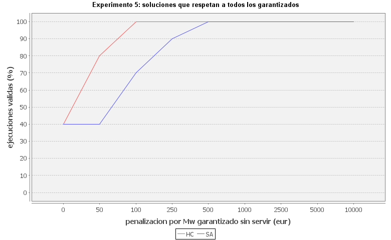

**Resultado.** Dos sorpresas.

Primera, **el umbral es mucho mas bajo de lo previsto**: a partir de **100 eur/Mw** Hill Climbing
da soluciones validas en las 10 replicas, y Simulated Annealing lo consigue a partir de
**500 eur/Mw**, es decir, en el entorno de la tarifa mas barata y no muy por encima. La explicacion
es que la penalizacion no compite con la tarifa completa sino solo con la capacidad que consume el
cliente; ademas el operador de apertura llena las centrales por beneficio partido por capacidad,
con lo que la penalizacion entra directamente en el criterio de llenado y empuja a los
garantizados al principio de la cola.

Que el recocido necesite cinco veces mas penalizacion que Hill Climbing es coherente con lo visto
en el apartado 6: acepta movimientos que empeoran, y con penalizaciones pequenas algunos de esos
movimientos dejan a un garantizado sin servir sin que la busqueda lo repare despues.

Segunda, y contraintuitiva: **el enfoque por penalizacion es mejor que el de restriccion**. Con
100 eur/Mw se llega a 1.378.441 frente a los 1.358.883 del experimento 2, un 1,4 % mas, y ademas
siempre valido. Partir de la solucion vacia deja que el algoritmo decida que centrales abrir desde
cero, en vez de heredar las decisiones del voraz. El precio es el tiempo: 139 ms frente a 8 ms,
unas 17 veces mas, porque la busqueda tiene que construir la solucion entera a base de aperturas.

Con penalizaciones muy altas el beneficio baja un poco y se estabiliza: una vez que todos los
garantizados se sirven, la penalizacion ya no se paga nunca y su valor deja de influir; las
variaciones que quedan son ruido entre optimos locales.

### 7.6. Experimento 6: mas centrales de tipo C

**Condiciones.** Escenario base duplicando y triplicando las centrales de tipo C, inicial VORAZ,
operadores y parametros ya fijados, 10 replicas.

**Hipotesis.** Que mas centrales pequenas repartidas geograficamente reduzcan las perdidas de
transporte y desplacen el uso de las centrales grandes, como sugiere el enunciado.

| Alg. | Centrales C | Beneficio | A usadas | B usadas | C usadas | Tiempo (ms) |
|---|---|---|---|---|---|---|
| HC | 25 | 1.358.883 (44.334) | 5,0 | 9,8 | 21,5 | 12,0 |
| HC | 50 | 1.284.674 (50.317) | 4,8 | 9,6 | 29,3 | 24,8 |
| HC | 75 | 1.154.504 (53.285) | 4,5 | 9,2 | 34,7 | 43,8 |
| SA | 25 | 1.356.414 (44.711) | 5,0 | 9,6 | 22,8 | 311,1 |
| SA | 50 | 1.278.027 (57.031) | 4,6 | 8,1 | 33,3 | 240,4 |
| SA | 75 | 1.164.261 (70.841) | 4,2 | 7,9 | 38,7 | 250,9 |

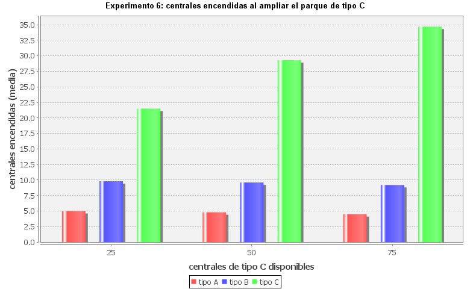

**Resultado.** El desplazamiento **existe pero es muy pequeno**, y el efecto global es claramente
negativo. Con el triple de centrales C el uso de las de tipo A baja de 5,0 a 4,5 y el de las B de
9,8 a 9,2 (con el recocido, de 9,6 a 7,9, algo mas marcado), mientras que las C usadas suben de
21,5 a 34,7. Pero el beneficio **cae un 15 %**.

La razon es la misma que en el experimento 4: las centrales C anadidas que no se usan siguen
pagando 1.500 eur diarios de parada cada una, y 50 centrales C de mas son 75.000 eur diarios
garantizados. Ademas las centrales A y B siguen siendo mucho mas eficientes por Mw (unos 50
eur/Mw una A frente a 150 una C), asi que aunque las C esten mas cerca no compensan: el ahorro en
perdidas de transporte no llega a cubrir ni el sobrecoste de produccion ni el coste de parada.

**Conclusion para la empresa:** repartir mas centrales pequenas **no sale a cuenta** con esta
estructura de costes. Solo lo haria si el coste de parada de las C fuese casi nulo, o si las
perdidas de transporte fuesen mucho mayores de lo que son.

### 7.7. Experimento 7: funciones heuristicas y ponderaciones

**Condiciones.** Escenario base, Hill Climbing, inicial VORAZ, 10 replicas. Se prueban las tres
heuristicas del apartado 5 con pesos 1, 10, 50 y 200 eur/Mw, y con los dos conjuntos de
operadores, porque la hipotesis es que el efecto de la heuristica depende de si los operadores ya
dan gradiente o no.

**Hipotesis.** Que un criterio secundario ayude sobre todo con los operadores simples, que es
donde el beneficio a secas es ciego, y que un peso demasiado alto acabe siendo contraproducente
porque deja de optimizarse el objetivo real.

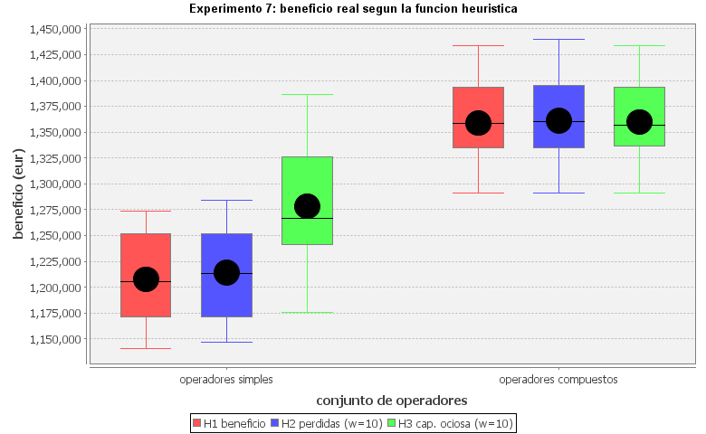

Con **operadores simples**, donde H1 se queda clavado en un solo paso:

| Heuristica | Beneficio | Mw perdidos | Pasos | Frente a H1 |
|---|---|---|---|---|
| H1 beneficio | 1.207.656 (46.790) | 490 | 1,0 | - |
| H2 perdidas (w=10) | 1.214.193 (47.865) | 487 | 9,0 | 5/10, p = 0,06 |
| **H3 cap. ociosa (w=10)** | **1.278.441 (67.785)** | 567 | **124,2** | **10/10, p = 0,002** |

Con **operadores compuestos**:

| Heuristica | Beneficio | Mw perdidos | Pasos | Frente a H1 |
|---|---|---|---|---|
| H1 beneficio | 1.358.883 (44.334) | 713 | 10,8 | - |
| H2 perdidas (w=10) | 1.361.126 (46.389) | 700 | 19,6 | 5/10, p = 0,22 |
| H3 cap. ociosa (w=10) | 1.359.856 (45.259) | 734 | 42,1 | 4/10, p = 0,69 |

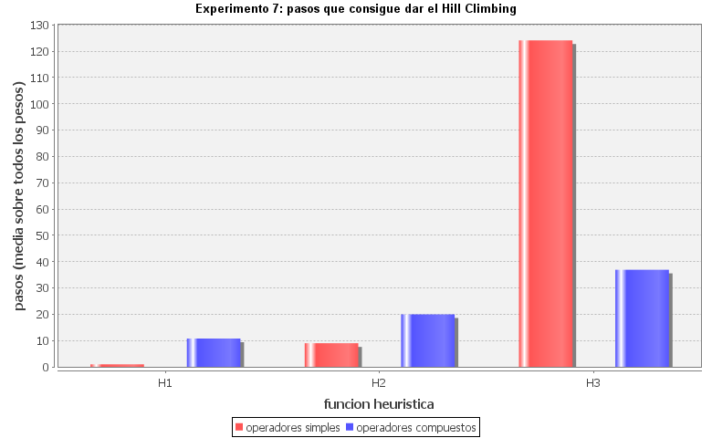

**Resultado.** La hipotesis se confirma, y de forma muy marcada.

Con operadores simples, **H3 multiplica por 124 el numero de pasos y mejora el beneficio un 5,9 %,
ganando en las 10 replicas** (p = 0,002). El mecanismo es exactamente el previsto: penalizar la
capacidad ociosa hace que mover un cliente hacia una central mas llena sea una mejora estricta, la
meseta se convierte en pendiente y Hill Climbing puede recorrerla hasta llegar a configuraciones
desde las que si compensa cerrar centrales.

H2 apenas ayuda (5/10, no significativo). Es un resultado interesante porque el razonamiento que
llevaba a H2 parecia el mas natural: las perdidas son lo unico que cambia al mover un cliente. Lo
que falla es que reducir perdidas **no acerca a apagar una central**; reparte la holgura entre
todas en vez de concentrarla. De hecho H3 empeora las perdidas (567 frente a 490 Mw) y aun asi da
mucho mas beneficio, lo que confirma que el criterio util no es la eficiencia del transporte sino
la concentracion de la carga.

Con operadores compuestos **ninguna de las dos aporta nada significativo** (5/10 y 4/10). Era de
esperar: `ABRIR` y `CERRAR` ya muestran de golpe toda la mejora de encender o apagar una central,
asi que el gradiente artificial deja de hacer falta. Lo unico que queda es coste, entre 2 y 4 veces
mas pasos para el mismo resultado.

**Efecto de la ponderacion:**

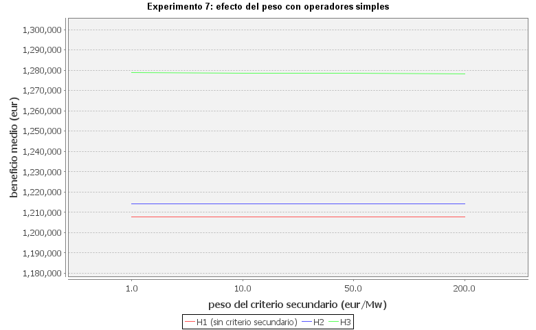

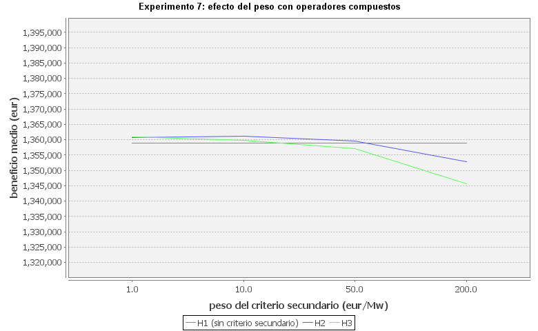

Entre `w = 1` y `w = 50` los resultados son **identicos hasta el ultimo euro** con operadores
simples (H2 da 1.214.193,41 para los tres pesos, con los mismos 9 pasos). No es casualidad: Hill
Climbing solo usa el **orden** de los sucesores, no la magnitud de la diferencia, de modo que
mientras el termino secundario sea lo bastante pequeno para no invertir ninguna comparacion entre
beneficios reales distintos, cambiar `w` no cambia el camino recorrido. La ponderacion solo actua
como criterio de desempate, que es precisamente para lo que se diseno.

A partir de `w = 200` el termino secundario empieza a competir con el objetivo y el beneficio real
cae: con operadores compuestos, H2 pasa de 1.361.126 a 1.352.822 y H3 de 1.359.856 a 1.345.721.
Ahi la busqueda ya esta optimizando algo que no es lo que se pide. **El rango util es amplio (de 1
a unas decenas de eur/Mw) y el limite superior esta en torno a 100**, coherente con lo previsto en
el apartado 5.3.

**Decision.** Para los experimentos del enunciado se usa **H1**, porque con el conjunto de
operadores elegido las otras dos no aportan nada y cuestan mas tiempo. El valor de H2 y H3 es
diagnostico: demuestran que la meseta del apartado 4.1 es real y que se puede atacar por dos vias
independientes, la de los operadores y la de la heuristica.

### 7.8. Experimento 8: Hill Climbing frente a Simulated Annealing

**Condiciones.** Escenario base, inicial VORAZ, k = 8, recocido con los parametros ajustados en el
experimento 3 (100.000 iteraciones, 1.000 por temperatura, k = 5, lambda = 0,01), 10 replicas. Se
comparan los dos algoritmos con el conjunto de operadores simples y con el que incluye los
compuestos, para separar cuanto de la diferencia se debe al algoritmo y cuanto al diseno de los
operadores.

| Alg. | Operadores | Beneficio | Mejora sobre la inicial | Tiempo (ms) |
|---|---|---|---|---|
| HC | MOVER_ASIGNAR | 1.207.656 (46.790) | **0 (0)** | 0,7 |
| SA | MOVER_ASIGNAR | 1.305.068 (69.671) | 97.411 (40.622) | 76,7 |
| **HC** | MOVER_ASIGNAR_CENTRALES | **1.358.883 (44.334)** | 151.227 (37.693) | **11,8** |
| SA | MOVER_ASIGNAR_CENTRALES | 1.357.830 (45.743) | 150.174 (33.451) | 312,7 |

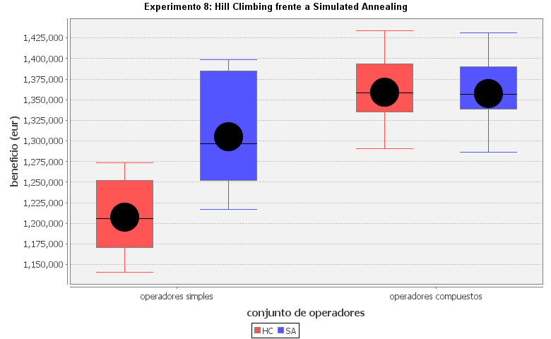

La comparacion **depende por completo de los operadores, y en sentidos opuestos**.

**Con operadores simples gana el recocido, y por mucho.** Hill Climbing mejora exactamente cero en
las 10 replicas. El recocido saca un 8,1 % mas, ganando en las 10 replicas (p = 0,002).

El mecanismo es mas preciso de lo que sugiere la explicacion habitual de "escapar de optimos
locales". Por lo visto en el apartado 6, con saltos de energia de miles de euros y temperaturas
entre 1 y 125 el recocido **practicamente nunca acepta un empeoramiento real**. Lo que si hace es
aceptar los **movimientos laterales con probabilidad 1/2**, porque con `deltaE = 0` la regla
logistica da exactamente esa probabilidad. Y los movimientos laterales son justamente los que
abundan aqui: toda la meseta del apartado 4.1. El recocido pasea por la meseta, redistribuye la
carga y de vez en cuando llega a una configuracion donde si cabe un cliente mas o donde si se puede
cerrar una central. Es la misma via que explota H3 en el experimento 7, solo que por azar en vez de
por gradiente.

**Con los operadores compuestos se igualan, y entonces gana Hill Climbing por tiempo.** Las medias
quedan a un 0,08 % una de otra y el recocido solo gana en 3 de las 10 replicas (p = 0,34), asi que
no hay diferencia de calidad; pero Hill Climbing tarda 12 ms y el recocido 313, unas **27 veces
mas**. Al dar a Hill Climbing operadores que muestran de golpe toda la mejora de encender o apagar
una central, desaparecen los optimos locales donde el recocido sacaba ventaja.

**Conclusion.** En este problema **el diseno de los operadores ha resultado ser bastante mas
determinante que la eleccion del algoritmo**: cambiar de Hill Climbing a recocido con operadores
simples da 97.000 eur, pero anadir los operadores compuestos a Hill Climbing da 151.000. Una vez
hecho ese trabajo, la eleccion razonable es Hill Climbing, que da la misma calidad en una fraccion
del tiempo. El experimento 5 apunta en la misma direccion: partiendo de la solucion vacia, Hill
Climbing llega a 1.378.441 y el recocido a 1.350.575.

---

## 8. Resumen y conclusiones

1. **El problema tiene una estructura de meseta muy marcada.** El beneficio solo depende de que
   centrales estan encendidas, mientras que el espacio de busqueda esta formado por asignaciones
   de clientes. La inmensa mayoria de los movimientos no cambia el objetivo.
2. **Esa meseta se puede atacar por tres vias independientes**, y las tres funcionan: operadores
   compuestos que muestran la mejora entera de golpe (+12,5 %), una heuristica con un criterio
   secundario de desempate (+5,9 % con operadores simples), y un algoritmo que acepta movimientos
   laterales (+8,1 % con operadores simples). La primera es con diferencia la mas eficaz y la mas
   barata.
3. **El diseno de los operadores pesa mas que la eleccion del algoritmo.** Con buenos operadores,
   Hill Climbing iguala al recocido en calidad y lo bate 27 a 1 en tiempo.
4. **La solucion inicial determina el optimo local**, no solo la velocidad de llegada.
5. **Mas infraestructura no es mejor.** Tanto anadir centrales (experimento 4) como anadir
   centrales pequenas repartidas (experimento 6) reduce el beneficio, porque las centrales paradas
   siguen costando dinero.
6. **Conviene leer el codigo de la libreria.** El corte del recocido por desbordamiento de la
   temperatura y la probabilidad 1/2 para los movimientos laterales explican resultados que de otro
   modo se habrian atribuido a la convergencia del algoritmo.

---

## 9. Respuestas a las preguntas del enunciado

**Que elementos intervienen y cual es el espacio de busqueda.** Centrales (tipo, produccion,
coordenadas) y clientes (tipo, contrato, consumo, coordenadas). El espacio son todas las
asignaciones de clientes a centrales o a "sin servir", del orden de `41^1000` en el escenario base.
El subespacio que de verdad determina el beneficio es mucho menor: que centrales estan encendidas
(`2^40`) y que no garantizados se sirven.

**Que es un estado inicial y que condiciones cumple un estado final.** Un estado inicial es
cualquier asignacion valida: todos los garantizados servidos y sin superar la capacidad de ninguna
central. En busqueda local no hay estado final reconocible: el test de objetivo devuelve siempre
`false` y el algoritmo para cuando no encuentra mejora (Hill Climbing) o agota las iteraciones o la
temperatura (recocido).

**Factor de ramificacion.** Con el conjunto elegido y k = 8, unos 8.000 sucesores por paso, de los
cuales solo 80 (las aperturas y los cierres) pueden cambiar el beneficio.

**Que conjunto de operadores da mejores resultados.** MOVER_ASIGNAR_CENTRALES. Anadir el
intercambio no mejora nada y encarece cada paso un 44 %.

**Que estrategia inicial es mejor.** La voraz, que gana en las 10 replicas (p = 0,002) y ademas
determina un optimo local mejor, no solo un camino mas corto.

**Que parametros del recocido son mejores.** `lambda = 0,01`, `k` indiferente, 100.000 iteraciones.
El enfriamiento rapido (`lambda = 1`) degrada el resultado porque corta la busqueda a los 800
pasos; `lambda` mas pequenos dan la misma calidad y cuestan un 30 % mas de tiempo. `k` es
irrelevante en todo el rango probado porque es varios ordenes de magnitud menor que los saltos de
energia.

**Que funcion heuristica es mejor y como influye la ponderacion.** Con el conjunto de operadores
elegido, las tres son equivalentes y se usa la mas simple (beneficio puro). Con operadores simples,
penalizar la capacidad ociosa mejora un 5,9 % ganando en las 10 replicas. El peso es indiferente
entre 1 y 50 eur/Mw, porque solo actua como desempate, y es contraproducente a partir de 200.

**Rango de penalizacion que garantiza soluciones validas.** A partir de 100 eur/Mw con Hill
Climbing y de 500 eur/Mw con el recocido.

**Duplicar o triplicar las centrales de tipo C hace que se usen menos las A y B.** Si, pero muy
poco (de 5,0 a 4,5 centrales A y de 9,8 a 9,2 B), y el beneficio cae un 15 % por los costes de
parada de las centrales que sobran.

---

## 10. Competencia de trabajo en equipo

> *Apartado a completar por el grupo con sus datos reales antes de la entrega. Lo que sigue es la
> estructura que pide el capitulo 9 del enunciado y el guion semanal del capitulo 6.*

### 10.1. Organizacion del equipo

- **Integrantes:** *(nombres)*
- **Mecanismos de comunicacion:** *(por ejemplo: canal de mensajeria para el dia a dia, reunion
  semanal presencial tras la sesion de laboratorio, repositorio compartido para el codigo)*
- **Calendario de reuniones y acuerdos tomados en cada una:** *(fechas y decisiones)*
- **Como se han resuelto las discrepancias:** *(por ejemplo, decisiones de diseno que se han
  zanjado midiendo en vez de discutiendo, como la eleccion del conjunto de operadores)*

### 10.2. Seguimiento del guion y reparto de tareas

| Semana | Objetivos del guion | Responsable | Estado |
|---|---|---|---|
| 1 | Entender AIMA, ejecutar los ejemplos, leer el enunciado | | |
| 2 | Disenar la representacion del estado y su interfaz | | |
| 3 | Implementar estado, solucion inicial y operadores | | |
| 4 | Generadores de sucesores, estado final, heuristicas | | |
| 5 | Planificar, ejecutar y analizar los experimentos | | |
| 6 | Documentacion final | | |

La practica corresponde a unas 93 horas de esfuerzo del grupo. Conviene anotar aqui la dedicacion
real de cada miembro para poder contrastarla en la entrega presencial.

### 10.3. Cuestionario de la competencia

El formulario del apartado 9.1 del enunciado se rellena en la entrega presencial. Merece la pena
haber ido recogiendo evidencias durante el cuatrimestre para cada uno de sus cuatro bloques:
mantener relaciones cooperativas, planificar objetivos y responsabilidades, trabajar con eficacia
cumpliendo plazos, e intercambiar informacion y aceptar critica constructiva.

---

## 11. Trabajo de innovacion

> *Apartado obligatorio que se entrega junto con este informe. El enunciado (apartado 9.2) pide
> exactamente los cuatro puntos siguientes; hay que completarlos con el contenido real del grupo.*

### 11.1. Tema escogido

*(Maximo tres lineas describiendo el tema del trabajo de innovacion.)*

### 11.2. Reparto del trabajo

Quien se ha encargado de buscar la informacion para cada apartado del documento:

| Apartado del trabajo | Responsable de la busqueda de informacion |
|---|---|
| | |

### 11.3. Referencias encontradas

| Referencia | Apartados para los que es relevante | Fecha de acceso |
|---|---|---|
| | | |

### 11.4. Dificultades encontradas

*(Dificultades a la hora de buscar la informacion necesaria: por ejemplo, fuentes de pago,
informacion contradictoria entre fuentes, escasez de trabajos recientes, dificultad para
distinguir fuentes divulgativas de fuentes tecnicas.)*
